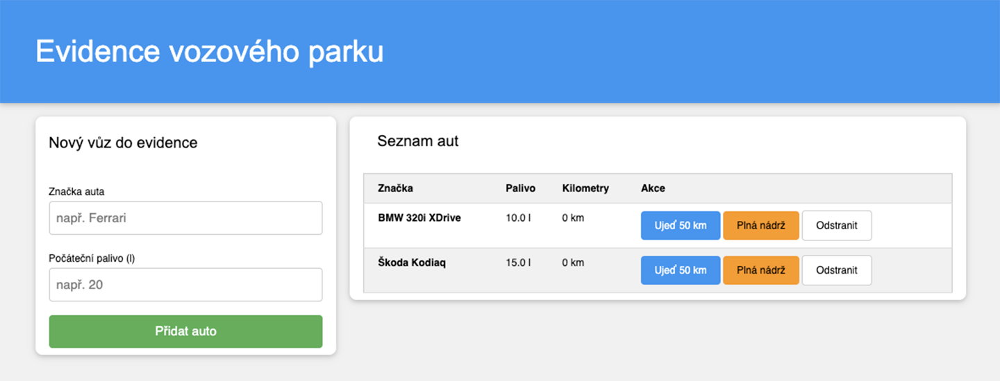

## Příklad: Evidence vozového parku

Představte si, že máte za úkol vytvořit systém pro firmu, která vlastní desítky automobilů. Každý vůz má jinou spotřebu, jiný stav nádrže a jiný počet najetých kilometrů. V klasickém programování byste pravděpodobně vytvořili mnoho nezávislých proměnných, ve kterých byste se brzy ztratili.

Naším cílem je vytvořit interaktivní webovou aplikaci, která umožní:

Evidovat vozidla: Přidávat nová auta do systému přes formulář.
Simulovat provoz: U každého auta umožnit jízdu (která spotřebovává palivo a přičítá kilometry) a tankování.
Hlídat technický stav: Automaticky upozornit na auta, která překročila servisní limit ujetých kilometrů.
Dynamicky spravovat seznam: Přehledně vypisovat všechna auta do tabulky a umožnit jejich mazání.

